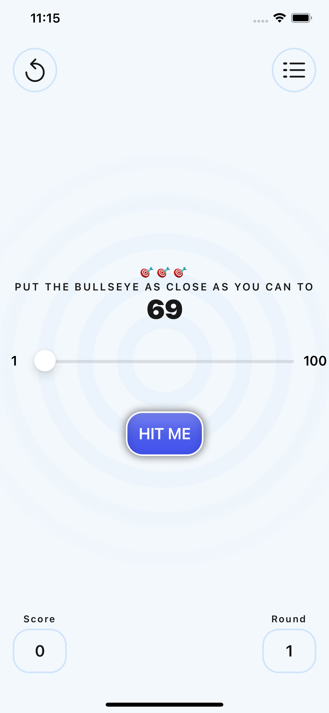
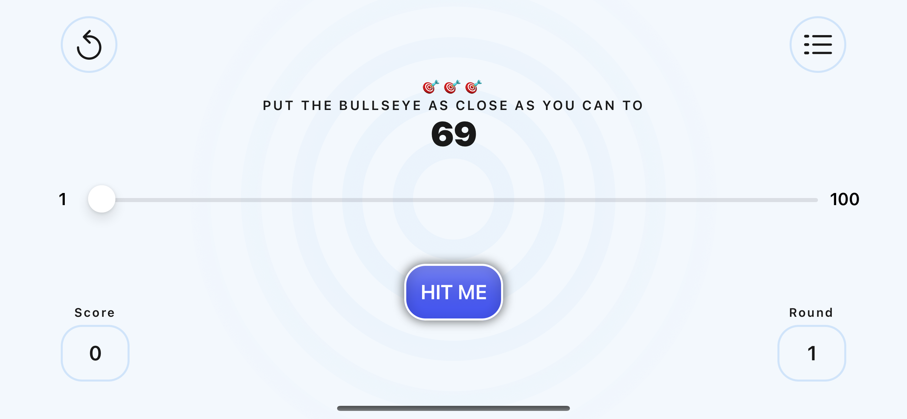

# Bullseye
This project is one of the apps made in my current progress of the reywenderlich course this app is mean to be one of the first *SwiftUI* apps created in this app you have a target value that you want to reach and use a slider in order to select a porcentage of the slider that needs to match the target value and obtain a score.

This codebase supports only iOS platform minimum OS version iOS 15.0

Orientations Portrait and landscape
-----

Project Setup
----

This project only uses native libraries so downloading the project and opening it with the latest version of xcode should do.

Architecture
------

Currently the project only has views and few models maybe in later version we could define an architecture depending on our needs.
